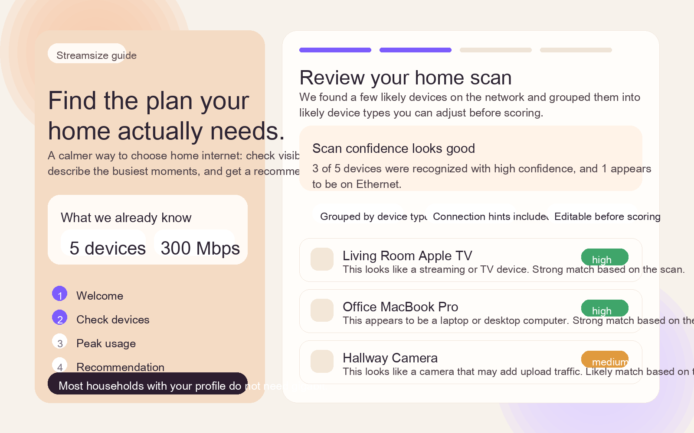

# Streamsize

Streamsize is an open source app that helps households estimate the internet plan they actually need instead of automatically paying for oversized service tiers.

An early desktop-first Flutter MVP for helping households avoid overbuying internet service.

It combines:
- a lightweight local device scan
- a guided household usage questionnaire
- a rules-based recommendation engine

The goal is simple: help people understand when 100 Mbps, 300 Mbps, 500 Mbps, or gigabit service is truly justified.

## Screenshots

### Desktop onboarding and device scan




## Project status

Streamsize is currently an early MVP.

Today, the project is best described as:
- desktop-first
- Flutter-based
- local-only processing
- open source and early in development

Current reality:
- the app UI is in place
- the recommendation engine is working
- the network discovery layer is currently mocked
- macOS/desktop development is the most mature path right now
- mobile support is planned, but not yet ready for public production claims

## Why this project exists

Internet providers often market larger plans than many households actually need.

In practice, the right plan depends more on:
- simultaneous 4K streams
- video calls
- work-from-home use
- gaming
- cloud backup
- security cameras
- peak-time usage

Streamsize is intended to give users a clearer and more honest recommendation.

## Features in the MVP

- guided onboarding flow
- desktop-first Flutter interface
- sample device scan review step
- household peak-usage questionnaire
- recommended download/upload plan tiers
- plain-English explanation of the recommendation

## Planned roadmap

### Near term
- replace the mock discovery service with real local network discovery on desktop
- improve the recommendation model and confidence scoring
- make results easier to share/export
- improve accessibility and platform polish

### Later
- Windows and Linux polish
- Android support
- iOS support with platform-appropriate limitations
- optional router or helper integrations for better accuracy

## Tech stack

- Flutter for app UI
- Dart for core logic
- local package structure for recommendation logic and platform discovery

## Repository structure

```text
apps/client_flutter/           Flutter app
packages/core/                 Recommendation engine and domain models
packages/platform_discovery/   Discovery abstraction and current mock implementation
```

## Platform support

Current support should be described publicly as:

- macOS: best current development target
- Windows: scaffolded, planned
- Linux: scaffolded, planned
- iOS: planned
- Android: planned

If you publish this repo now, I recommend saying:

> Streamsize is currently desktop-first, with mobile support planned as the product matures.

## Getting started

### Prerequisites

Install:
- Flutter 3.41+
- Dart 3.11+ (included with Flutter)
- Xcode for macOS development
- Android Studio if you later want Android builds

Check your setup:

```bash
flutter --version
flutter doctor
```

## Run the app on macOS

```bash
cd apps/client_flutter
flutter pub get
flutter run -d macos
```

## Run on another desktop target

List available devices:

```bash
flutter devices
```

Then run on the target you want:

```bash
cd apps/client_flutter
flutter run -d <device-id>
```

Examples:
- `flutter run -d macos`
- `flutter run -d windows`
- `flutter run -d linux`

## iPhone/iPad note

If Flutter tries to launch on a connected iPhone or iPad, you may need to enable Apple Developer Mode on the device.

If you only want to run on your Mac, use:

```bash
flutter run -d macos
```

## Tests and validation

### Flutter app

```bash
cd apps/client_flutter
flutter test
flutter analyze --no-pub
```

### Core package

```bash
cd packages/core
dart analyze
dart test
```

### Platform discovery package

```bash
cd packages/platform_discovery
dart analyze
```

## How recommendations work right now

The current MVP uses a transparent rules-based model.

Examples of inputs include:
- number of simultaneous 4K streams
- number of HD streams
- video calls
- remote workers
- online gamers
- security cameras
- large-download habits
- cloud backup usage

The engine then:
- estimates peak download demand
- estimates peak upload demand
- adds headroom
- normalizes the result into common plan tiers

This is intentionally simple and explainable.

## Privacy approach

The intended privacy model for Streamsize is:
- local-first processing
- no required account
- no packet-content inspection
- minimal metadata only for discovery/classification

## Contributing

Contributions are welcome.

If you want to contribute:
1. open an issue or discussion
2. fork the repo
3. create a branch
4. make changes
5. run the validators
6. open a pull request

Please keep contributions aligned with the project goals:
- honest consumer recommendations
- privacy-first local processing
- clear and explainable logic
- practical cross-platform support

## Suggested first public GitHub setup

When publishing this repository, I recommend:
- repository name: `streamsize`
- visibility: public
- description: `Open source app to estimate the right home internet speed for real household usage`
- topics: `flutter`, `dart`, `networking`, `bandwidth`, `internet`, `cross-platform`, `opensource`

## Recommended first release wording

Use wording like this in GitHub and the README:

> Streamsize is an early open source MVP for helping households estimate the internet speed they actually need. It is currently desktop-first, with mobile support planned.

## What to do next before or after publishing

Recommended next improvements:
- real desktop network discovery
- screenshots in the README
- GitHub Issues enabled
- GitHub Discussions enabled
- contribution and issue templates
- first tagged release once discovery is real

## License

This project is licensed under the MIT License.
